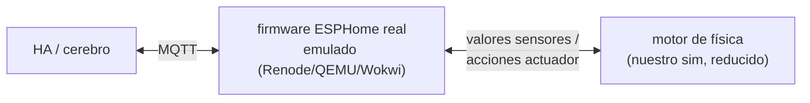

# ADR-0017: Simulación en capas — firmware real emulado sobre motor de física

## Contexto

Lo que simulamos es el **hardware** (ESP32, sensores, actuadores), no el producto ni la agronomía. El sim actual (TypeScript) colapsa dos cosas en un servicio: la física del mundo (EC, pH, tanque) y la imitación del firmware (publicar MQTT como lo haría ESPHome). Consecuencia: **hoy nada prueba el firmware ESPHome real** — podría diverger del sim y no lo sabríamos hasta el piloto de hardware (Fase 5).

Se verificó el mercado open-source: no existe simulador hidroponico drop-in (DSSAT/AquaCrop modelan suelo, no solución nutritiva; HydroBuddy es calculadora estática; Mycodo/HydroOne son sistemas de automatización, no simuladores). La física hay que escribirla igual en cualquier escenario — un emulador de MCU ejecuta firmware pero no genera el mundo.

## Decisión (propuesta)

Arquitectura destino en capas:

- **Motor de física**: el mundo (EC que cae, pH que deriva, tanque que se vacía, ET0 FAO-56). Es el sim actual menos la parte MQTT.
- **Firmware emulado**: el ESPHome YAML real compilado, corriendo en emulador. Prueba topics exactos, MQTT discovery de HA, reconexiones, deep sleep, OTA. La física entra por pines/bus emulados (custom chip Wokwi / periférico scriptado Renode).
- **HA/cerebro**: el producto, sin cambios — no distingue emulador de hardware real.

No viola "no hay dos simuladores" (ADR-0004): es un solo pipeline; el firmware emulado *reemplaza* la imitación TS, no coexiste con ella.

Candidato técnico principal: **Renode** (open-source, tiempo virtual → campaña de 45 días acelerable, scriptable en CI). Wokwi como alternativa (CLI para CI, custom chips).

## Operación de nodos

Agregar/quitar un nodo: la parte física es manual por diseño (compilar firmware, levantar instancia de emulador, declarar ubicación+cultivo — igual que instalar un ESP32 real), automatizable con un comando de aprovisionamiento (`add-node mod-5 --crop fresa`); desde la declaración, todo fluye automático (HA discovery, cerebro, física, finanzas). Quitar un nodo ejercita el caso real "ausencia de dato ≠ cero" (ADR-0006) y modo oficina (ADR-0010).

## Costos conscientes

- Glue física↔pines emulados no existe: hay que construirlo (semanas, no horas).
- Reproducibilidad end-to-end: el firmware tiene reloj/RNG propios; la semilla fija se complica.
- CI más pesado: compilar ESPHome + boot de firmware por corrida.

## Momento de adopción

**Diferido a Fase 3→5** (cuando el ESPHome YAML madure y valga validarlo antes de comprar el primer ESP32). En Fases 0–2 el sim TS actual basta: la frontera de realismo que el cerebro necesita es el contrato MQTT, no el silicio.

## Mejora de física (independiente, cualquier fase)

- Evaluar el modelo empírico de EC de **HydroBuddy** (open-source) para anclar la física del sim a un modelo publicado.

## Estado de implementación (2026-08-16) — aceptado con revisión

Se investigó la viabilidad de emulación de silicio antes de implementar (Renode 1.16, QEMU `qemu-system-xtensa`): **ninguno emula el WiFi del ESP32** — el radio es un "blob" propietario y la pila WiFi/MQTT de ESPHome no arranca en emulación. La emulación de silicio end-to-end no es posible hoy con tooling existente; el firmware ESPHome compilado queda como **artefacto de producción validado por contrato** (`pnpm contract` contra `contract/asyncapi.yaml`), no por ejecución emulada. Renode queda diferido hasta que exista emulación de radio.

La arquitectura en capas se implementó igual, con el firmware emulado en TypeScript hasta entonces:

- **Física como servicio** (`sim/src/physics/engine.ts`): la verdad del mundo, expuesta por un HTTP de **laboratorio** (`PHYSICS_PORT`, default 7751). Equivale al cable/pin bus: jamás lo consume el producto. `GET /api/nodes/{hw}/state`, `POST /api/nodes` (agregar mundo), `DELETE /api/nodes/{hw}`, `POST /api/nodes/{hw}/actuate`.
- **Emulador de nodo** (`sim/src/node/emulator.ts`): un proceso por `hw_id` = desenchufar el ESP32 es matar el proceso. Mide la física vía HTTP, aplica la capa de medición (ruido/deriva) y la lógica de auto-dosis del firmware (`sim/src/node/behavior.ts`, funciones puras testeadas), y habla MQTT plano dispositivo con wills por dispositivo (LWT real del broker).
- **Supervisor + ctl** (`sim/src/supervisor.ts`, `sim/src/ctl.ts`): `pnpm dev` levanta física + N nodos; `pnpm ctl add-node/remove-node` enchufa/desenchufa fierro en caliente. `add-node` escribe el claim en `device_identities` (canal del dueño, ADR-0015/0016).

Verificado en vivo (2026-08-16): lazo completo física→nodo→router→Telegraf/DB; contrato AsyncAPI verde en ambos planos (dispositivo 1652 + interno 1635 mensajes); `remove-node` (SIGKILL al grupo de proceso) dispara el LWT del broker y el router lo espeja al plano interno (`offline` en ambos planos); `add-node --crop tomate` claima un `hw_id` nuevo, spawnea el emulador y el router publica HA discovery de `mod-5` sin reiniciar nada. Hallazgo operativo: `SIGKILL` debe ir al **grupo de proceso** (`spawn` con `detached: true` + `process.kill(-pid)`) — matar solo al wrapper `pnpm` deja el emulador huérfano publicando.

`pnpm dev` del sim ahora arranca el supervisor (mundo completo). El monolito `sim/src/index.ts` fue eliminado.

## Nota ADR-0015 (2026-08-16) — identidad dinámica

Con ADR-0015 los nodos emulados publican por `hw_id` en el plano dispositivo (`terra/{hw_id}/...`), no por `tenant/module`. El router traduce al plano interno. En este modelo, **quitar un nodo** (matar el proceso que emula ese `hw_id`) ejercita exactamente el caso real: el LWT del broker publica `offline` en `terra/{hw_id}/{device}/status/status`, el plano interno deja de recibir lecturas y el sistema debe tratar **ausencia de dato ≠ dato cero** (ADR-0010). El **claiming** se prueba contra la DB (`device_identities`): asignar, reasignar y revocar `hw_id ↔ (tenant, module)` sin reflashear, verificando que el router refleja el cambio sin reiniciar el firmware emulado.
