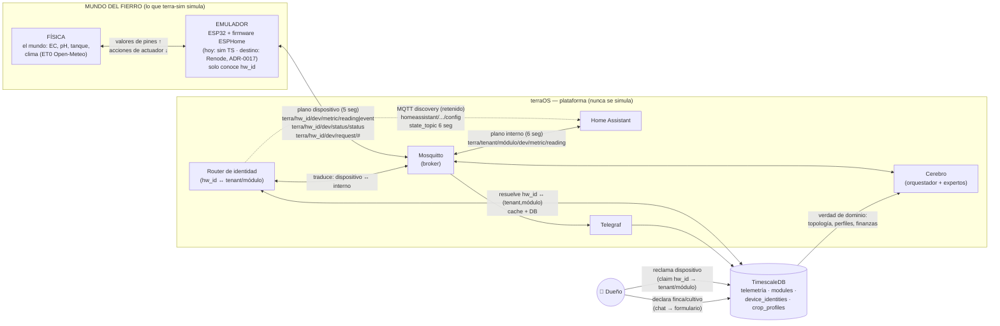

# terra-sim — Gemelo digital del mundo del fierro

Simulador del hardware de la finca (sensores, actuadores, clima) para desarrollar y
probar terraOS **sin hardware real**. Publica por MQTT con el mismo contrato que
usará el ESP32 real (`contract/asyncapi.yaml`): quien consume al sim no distingue
simulación de producción.

El sim es un **dispositivo tonto** (ADR-0015): solo conoce su `hw_id` de fábrica
(MAC sin dos puntos, 12 hex). Jamás publica `tenant`/`módulo`/`cultivo`; la
identidad lógica vive en la DB (`device_identities`) y la resuelve el **router**
de identidad.

## Arquitectura



**Dos planos MQTT (ADR-0015):**

| Plano | Segmentos | Ejemplo | Quién lo habla |
|---|---|---|---|
| **Dispositivo** (fierro) | 5 | `terra/020000000001/ec-01/ec/reading` | Sim / ESP32 — solo `hw_id` |
| **Interno** (plataforma) | 6 | `terra/demo/mod-1/ec-01/ec/reading` | Router → HA/Cerebro/Telegraf/Grafana |
| **Discovery HA** | — | `homeassistant/sensor/…/config` | **Router** (plataforma), nunca el fierro |

El router suscribe el plano dispositivo (`reading`/`event`/`status`/`confidence`),
resuelve `hw_id → (tenant,módulo)` en `device_identities` y republica en el plano
interno con payload idéntico. A la inversa, suscribe `terra/+/+/+/request/#`
(plano interno) y lo reenvía como `terra/{hw_id}/{device}/request/{action}`.
`hw_id` desconocido → log + descarte.

**Componentes y comunicación:**

| Componente | Rol | Habla | Con quién |
|---|---|---|---|
| **Física** | El mundo: la planta consume EC, el tanque se vacía, el clima pega | valores de pines / acciones de actuador | Emulador |
| **Emulador** | El fierro tonto: firmware que mide (con ruido/deriva) y actúa — solo `hw_id` | MQTT plano dispositivo (5 seg), LWT | Mosquitto |
| **Router** | Traduce identidad: `hw_id ↔ (tenant,módulo)` + publica HA discovery | MQTT ambos planos + SQL | Mosquitto + DB |
| **Mosquitto** | Buzón central — único canal fierro↔producto | MQTT | Todos |
| **Home Assistant** | Tablero y control manual del dueño (descubre vía router) | MQTT plano interno | Mosquitto |
| **Cerebro** | El administrador: observa, decide, propone | MQTT plano interno + SQL | Mosquitto + DB |
| **Telegraf** | Transcribe telemetría del plano interno a historial | MQTT → SQL | Mosquitto → DB |
| **TimescaleDB** | Verdad de dominio e historia (ADR-0016) + `device_identities` (ADR-0015) | SQL | Cerebro, Telegraf, Grafana, Router |
| **Dueño** | Actor: reclama dispositivos y declara cultivo | chat/formulario → DB | DB |

**Reglas que el diagrama hace visibles:**

- **Un solo canal fierro↔producto: MQTT.** La física nunca toca la DB; el cerebro nunca toca la física. Si una flecha no existe con hardware real, no existe aquí.
- **El fierro jamás publica `tenant`/`módulo`/`cultivo`.** Solo `hw_id`. La identidad se asigna en la DB vía claiming y la resuelve el router (ADR-0015).
- **La declaración del dueño entra por la DB**, no por archivos (ADR-0016). Los YAML `farms/demo.yaml` describen el mundo físico (nodos por `hw_id`); la verdad lógica vive en `device_identities`.
- **Discovery HA lo publica la plataforma (router), nunca el dispositivo.**
- **El lazo se cierra por el contrato:** comando (plano interno → router → dispositivo) → actuador → la física reacciona → siguiente medición lo refleja.
- Física y Emulador son **procesos separados** (ADR-0017 implementado): `physics/engine.ts` expone la verdad del mundo por HTTP de laboratorio; cada `node/emulator.ts` es un ESP32 emulado (un proceso por `hw_id`) que mide la física vía HTTP y habla MQTT. Renode queda diferido: hoy no emula el WiFi del ESP32 (ver ADR-0017).

## Uso

```bash
pnpm install

# arranque normal (supervisor: física + un emulador de nodo por hw_id, reloj 1:1, clima real Open-Meteo)
pnpm dev

# campaña acelerada offline, semilla fija (reproducible)
pnpm dev --offline --speed 60 --seed 42

# con escenario de fallos
pnpm dev --scenario sensor_muerto --speed 240
```

Al arrancar, el supervisor levanta la física y un proceso emulador por `hw_id` declarado en `farms/demo.yaml`:

```
[supervisor] mundo listo: 4 nodos (020000000001, 020000000002, 020000000003, 020000000004)
```

**Enchufar / desenchufar fierro en caliente** (laboratorio, `pnpm ctl`):

```bash
pnpm ctl list                                    # nodos vivos + estado de la física
pnpm ctl add-node --crop tomate [--hw X]         # claim en DB + spawnea emulador (como conectar un ESP32)
pnpm ctl remove-node --hw 020000000003           # SIGKILL al proceso: el LWT del broker publica offline
pnpm ctl remove-node --hw X --unclaim            # además revoca el claim en device_identities
pnpm ctl scenario sensor_muerto                  # cambio de escenario EN CALIENTE (sin reiniciar el mundo)
```

`remove-node` ejercita el caso real "ausencia de dato ≠ cero" (ADR-0006/0010): el
LWT se refleja en ambos planos (`terra/{hw_id}/...` y, vía router, `terra/{tenant}/{module}/...`).

| Flag | Default | Efecto |
|---|---|---|
| `--speed N` | `1` | Multiplicador del reloj sim (Nx para tests/campaña). |
| `--seed N` | `42` | Semilla RNG: misma semilla → misma corrida. |
| `--offline` | off | Sin red: curva ET0 fija + clima sintético. |
| `--scenario NAME` | `normal` | Escenario de `scenarios/NAME.yaml`. |
| `--start ISO` | ahora | Época sim inicial fija (tests reproducibles). |

Requiere Mosquitto en `MQTT_URL` (default `mqtt://localhost:1883`) — ver `docker-compose.yml` en la raíz.
La física expone un HTTP de laboratorio en `PHYSICS_PORT` (default `7751`, jamás consumido por el producto)
y el supervisor un HTTP de control en `SUPERVISOR_PORT` (default `7750`) usado por `pnpm ctl`.
El sim **no necesita** el router ni la DB para arrancar; `add-node` sí (escribe el claim en `device_identities`).

## Monitor de laboratorio (Node-RED)

Grafana es el explorador de **datos** y HA el monitor de **dispositivos** — ninguno muestra
el simulador en sí. El **banco de laboratorio** es Node-RED + FlowFuse Dashboard 2.0
(servicio `nodered` del compose, `sim/nodered/`):

- **Dashboard:** http://localhost:1880/dashboard/lab — tarjeta por nodo con **verdad física
  vs. lo publicado** (y su Δ: el ruido/deriva que el sensor emulado mete), estado LWT
  online/offline, fallos inyectados, temporizadores de dosificadores, reloj sim (día,
  velocidad, escenario) y clima actual.
- **Controles:** "Desenchufar" por tarjeta (mata el proceso emulador → LWT real) y
  "+ Enchufar nodo" (elige cultivo → claim en DB + spawn + discovery). Todo va por el
  ctl del supervisor (`:7750`), igual que `pnpm ctl`.
- **Editor de flows:** http://localhost:1880 (sin auth — solo laboratorio).

El tablero lee la verdad del mundo del endpoint agregado `GET :7751/api/state` y lo
publicado del plano dispositivo MQTT (`terra/+/...`). Además permite **enchufar/**
**desenchufar nodos y cambiar el escenario en caliente** (select + Aplicar → ctl del
supervisor). Vive en el plano laboratorio: jamás está en el camino del producto.

## Tests y contrato

```bash
pnpm test          # vitest: física, realismo, reloj dual, persistencia, comportamiento del nodo, topics 5-seg
pnpm contract 30   # captura N segundos del broker vivo y valida ambos planos (5 y 6 seg) contra contract/asyncapi.yaml
```

`contract-check` valida que todo mensaje observado cumpla `contract/asyncapi.yaml` y
reporta desglose por plano (`dispositivo=… interno=…`). A los 5s dispara un `set` por el
plano interno (ejercicio activo) y exige al menos un `Reading`, un `Status` y un `Event`.
Un `Request` con payload crudo (`ON`/`OFF`) es válido (Fase 0); el resto exige JSON.

## Reglas de la casa

- **El sim es el fierro, no el producto.** Cerebro/HA/Telegraf/Router nunca se simulan.
- **El fierro jamás publica `tenant`/`módulo`.** Todo topic del sim es `terra/{hw_id}/…` (5 segmentos). Si ves `terra/demo/…` en `sim/src/`, es un bug.
- **Nadie de producción lee estos YAML** (ADR-0016): `config/` y `farms/` son el
  arranque del gemelo; la verdad de dominio en runtime vive en la DB (`crop_profiles` + `device_identities`).
- **Sin puertas traseras:** todo lo que el mundo "declara" entra como lo haría un humano (claim en DB).
- **Confianza honesta (ADR-0010):** la `confidence` publicada decae con la deriva
  acumulada del instrumento (`confidenceFor` en `sensors.ts`, piso 40); 100 eterno = bug.
- Determinismo: misma semilla + mismo escenario + misma época = misma corrida
  (los `ts` de status/lecturas/eventos/confianza son de reloj sim; solo el LWT del broker
  lleva hora real — la muerte súbita no es parte de la campaña).
